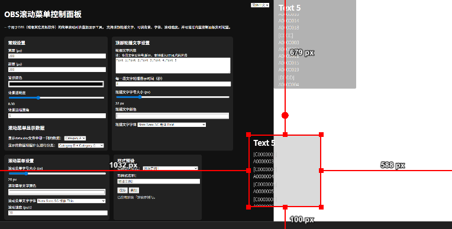

# OBS Rolling Menu

A simple browser-source overlay tool for OBS (or similar software) that displays a scrolling list and 
rotating text, automatically sorts and classifies based on data, and is fully customizable through a 
built-in web control panel.

一个用于OBS（或者其它类似软件）的简单滚动列表叠加显示工具，支持顶部轮播文字、可调背景、字体、滚动速度，根据数据自动分类排序，并可通过内置控制面板实时配置。



## Data Format | 数据格式

`data.xlsx` is the data source used by the overlay to generate scrolling list items (and optional grouping).
You may customize the number of columns and the content freely, as long as there is at least one header row.

`data.xlsx`是叠加层内容的数据源，用于生成滚动列表和可选的分组标题。可以自由增加或减少列，只需要保证至少包含一行列名。

### Examples | 示例

Example 1:

| Category A | Category B | Category C | ... |
|------------|------------|------------|-----|
| AAA111     | B1         | CCC1       | ... |
| AAA222     | B1         | CCC2       | ... |
| AAA333     | B2         | CCC3       | ... |
| AAA444     | B3         | CCC4       | ... |
| AAA555     | B1         | CCC5       | ... |
| AAA666     | B2         | CCC6       | ... |
| ...        | ...        | ...        | ... |

Example 2:

| Artist | Song            | Genre     |
|--------|-----------------|-----------|
| A      | Never Give Up   | Pop       |
| A      | Wild Roads      | Pop       |
| B      | Skyfall         | Rock      |
| C      | Orange Garden   | Ambient   |
| C      | Soft Lights     | Ambient   |

## How to Use | 如何使用

This tool provides two interfaces:

- **Control Panel**: used to configure the overlay  
- **OBS Overlay**: displayed inside OBS as a browser source  

本工具提供两个界面：

- **控制面板**：用于配置叠加层  
- **OBS 叠加层**：在 OBS 中以浏览器来源的形式显示  

### Quick Start

1. Download the latest version from [Release Page](https://github.com/hqrrr/obs-rolling-menu/releases)
2. Edit `_internal/data/data.xlsx` and save to update the list
3. Run the application:
   1. If you have Python environment, run `python main.py`
   2. If not, double-click the `OBS Rolling Menu.exe`
4. After the tool starts, open the control panel: `http://127.0.0.1:5000/` or `http://127.0.0.1:5000/control`

> If port `5000` is already in use by other services, the tool will find the next available port. 
> See the messages in the console.

5. In the control panel, you can:
   1. Select which Excel column to display 
   2. Choose whether to group rows 
   3. Edit the top rotating text 
   4. Change font family, size, color 
   5. Adjust overlay width, height, scroll speed 
   6. Modify background color and opacity 
   7. Save / load style presets
6. Open `http://127.0.0.1:5000/overlay` to preview the overlay layout
7. Save or load style presets
8. Add the overlay to OBS: Open OBS -> Add -> `Browser Source` -> URL: `http://127.0.0.1:5000/overlay`
   1. Recommended OBS settings:
      1. Width >= same as overlay width in control panel
      2. Height >= same as overlay height

> If port `5000` is already in use by other services, the tool will find the next available port. 
> See the messages in the console.

9. Optional: Add custom fonts:
   1. Place font files (.ttf, .woff2) into `_internal/fonts/`
   2. Define the font in `_internal/ui/style.css` (at the end of the file), example:
   ```
    /* noto-sans-sc-100 - chinese-simplified_cyrillic_latin_latin-ext */
    @font-face {
      font-display: swap;*/
      font-family: 'Noto Sans SC';
      font-style: normal;
      font-weight: 100;
      src: url('../fonts/noto-sans-sc-v39-chinese-simplified_cyrillic_latin_latin-ext-100.woff2') format('woff2'); /* Chrome 36+, Opera 23+, Firefox 39+, Safari 12+, iOS 10+ */
    }
    ```
10. Optional: Add custom images
    1. Place icons/images into `_internal/pics/`
    2. Then reference them in overlay text using HTML `` if needed, example:
    ```
    Text 1;Text 2;Text 3;Text 4
    ```

### 快速上手

1. 从 [Release](https://github.com/hqrrr/obs-rolling-menu/releases) 页面下载最新版本  
2. 编辑 `_internal/data/data.xlsx` 来更新显示列表，然后保存  
3. 运行应用程序：  
   1. 如果你已安装 Python 环境，可执行 `python main.py`  
   2. 如果没有 Python 环境，直接双击 `OBS Rolling Menu.exe`  
4. 工具启动后，打开控制面板：  
   `http://127.0.0.1:5000/` 或 `http://127.0.0.1:5000/control`  

> 如果端口 `5000` 已被其他程序占用，工具会自动寻找下一个可用端口。  
> 请查看终端窗口中的提示信息。

5. 在控制面板中你可以：  
   1. 选择 Excel 中要显示的列  
   2. 设置是否按某列分组  
   3. 编辑顶部轮播文字  
   4. 调整字体、字号、颜色  
   5. 调整显示区域宽度、高度、滚动速度  
   6. 修改背景颜色与透明度  
   7. 保存 / 加载样式预设  
6. 打开 `http://127.0.0.1:5000/overlay` 预览最终显示样式  
7. 保存或加载样式预设  
8. 将 Overlay 添加到 OBS：  
   OBS -> 添加来源 -> `浏览器(Browser Source)` -> URL 填入：  
   `http://127.0.0.1:5000/overlay`  
   1. 推荐的 OBS 设置：  
      1. 宽度 >= 控制面板中设置的 Overlay 宽度
      2. 高度 >= 控制面板中设置的 Overlay 高度

> 如果端口 `5000` 已被其他程序占用，工具会自动寻找下一个可用端口。  
> 请查看终端窗口中的提示信息。

9. （可选）添加自定义字体：  
   1. 将字体文件（`.ttf`, `.woff2`）放入 `_internal/fonts/` 文件夹  
   2. 在 `_internal/ui/style.css` 最后添加字体定义，例如：
   ```
    /* noto-sans-sc-100 - chinese-simplified_cyrillic_latin_latin-ext */
    @font-face {
      font-display: swap;*/
      font-family: 'Noto Sans SC';
      font-style: normal;
      font-weight: 100;
      src: url('../fonts/noto-sans-sc-v39-chinese-simplified_cyrillic_latin_latin-ext-100.woff2') format('woff2'); /* Chrome 36+, Opera 23+, Firefox 39+, Safari 12+, iOS 10+ */
    }
    ```
10. （可选）添加自定义图片：  
    1. 将图标 / 图片放入 `_internal/pics/` 文件夹  
    2. 在顶部文本中通过 HTML `` 使用图片，例如：  
 ```
 Text 1;Text 2;Text 3;Text 4
 ```


## How to Build | 如何构建

1. `pip install -r requirements.txt`
2. `pip install pyinstaller`
3. `python build.py`

## Structure | 代码结构

```
obs-rolling-menu/
│
├── app.py              # Flask backend server
├── worker.py           # Background worker (optional)
├── reader.py           # Excel read & parsing
├── preset.py           # Preset save/load system
├── util.py             # Utilities
├── version.py          # Version
├── build.py            # Build config for PyInstaller
│
├── ui/
│   ├── overlay.html    # OBS overlay page
│   ├── control.html    # Control UI
│   ├── overlay.js      # Frontend logic for overlay
│   ├── control.js      # Frontend logic for control panel
│   └── style.css       # Shared styles
│
├── fonts/              # Custom font files used by the overlay
├── pics/               # Optional images/icons used in the overlay
├── presets/            # Saved style presets as JSON files
│
└── data/
    └── data.xlsx       # Your input data
```